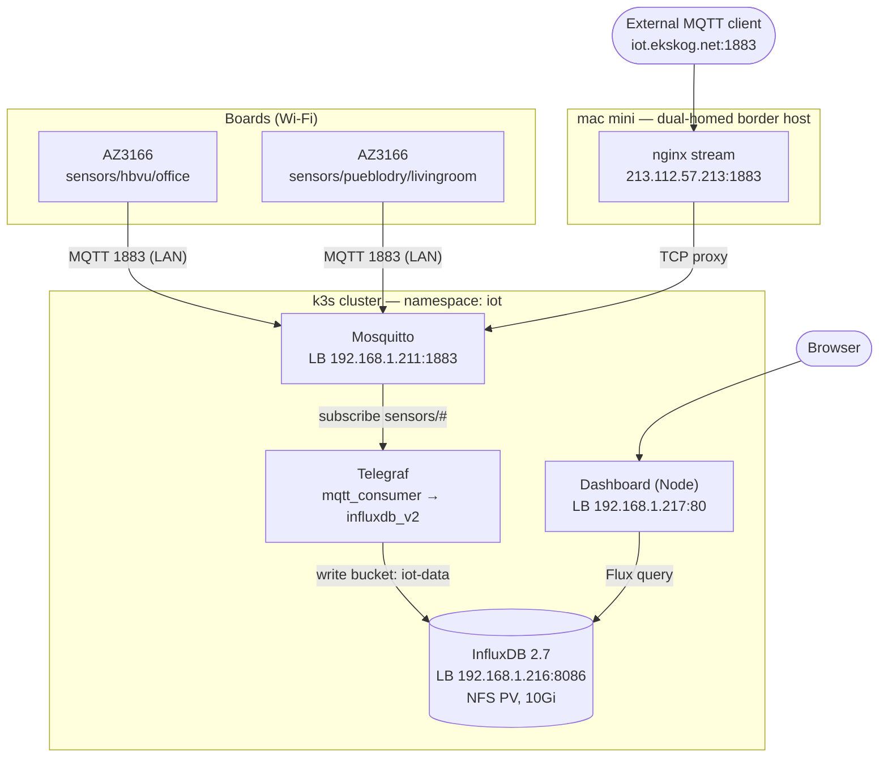

# MXChip Home Telemetry

Environmental telemetry from **MXChip AZ3166 IoT DevKit** boards, published over MQTT to a
k3s cluster, stored in InfluxDB, and read back through a small self-hosted dashboard.

Repurposing a drawer full of AZ3166 boards left over from Microsoft-era projects into a
small home sensor network.

## Architecture



The cluster is the hub. Boards are dumb MQTT publishers — no buffering, no retries beyond
reconnect. All aggregation, storage, and presentation happen in-cluster.

### Data flow

1. Each board reads HTS221 (temp/humidity) and LPS22HB (pressure) every 10s, shows the
   values on its OLED, and publishes JSON to `sensors/<site>/<room>`.
2. **Mosquitto** accepts on 1883. Boards reach it directly over the LAN; external clients
   arrive via nginx on the mac mini.
3. **Telegraf** subscribes to `sensors/#`, parses `site` and `room` out of the topic into
   tags, and writes to InfluxDB. No hand-written bridge.
4. **Dashboard** queries InfluxDB with Flux server-side and serves a single page.

## Hardware

**MXChip AZ3166 IoT DevKit** — one per room.

| Component | Part | Used for |
|-----------|------|----------|
| MCU | STM32F412RG (Cortex-M4F, 100 MHz) | firmware |
| Wi-Fi | EMW3166 (2.4 GHz b/g/n) | connectivity |
| Display | 128×64 OLED | local live readout |
| Temp / humidity | HTS221 | telemetry |
| Pressure | LPS22HB | telemetry |
| (unused) | LIS2MDL magnetometer, LSM6DSL accel/gyro, mic | future |

Currently deployed: `hbvu/office` and `pueblodry/livingroom`.

## Firmware

Built with **arduino-cli** and Microsoft's AZ3166 core (GCC 5.4). The PlatformIO project
under `firmware/src/` proved the sensors and OLED but its Wi-Fi path was never verified —
**use `firmware/telemetry/` for anything with Wi-Fi.** See `firmware/README.md` for the
toolchain install and the full story.

Two gotchas worth knowing before touching a board:

- **The bootloader must match SDK 2.0.0**, or Wi-Fi crashes at boot (blank OLED, solid-red
  RGB). Run `./flash-bootloader.sh` **once per physical board** — no upload recipe writes
  it. Sensor-only firmware works without it.
- **Identity is compiled in.** `SITE`, `ROOM`, and `MQTT_CLIENT_ID` come from
  `telemetry/secrets.h`, so the file always reflects *the last board you flashed*. Two
  boards sharing an `MQTT_CLIENT_ID` will repeatedly kick each other off the broker.

```sh
cd firmware
cp telemetry/secrets.h.example telemetry/secrets.h   # Wi-Fi, broker, SITE/ROOM/client id
./flash-bootloader.sh                                # once per new board
./build.sh
./flash.sh telemetry/build/telemetry.ino.bin
```

Flash with **only the target board connected** — `flash.sh` drives OpenOCD without a probe
serial, so with two boards attached it will grab whichever ST-Link enumerates first.

## Topic and schema

```
topic:   sensors/<site>/<room>
example: sensors/hbvu/office
payload: {"temp":31.2,"humidity":47.6,"pressure":1016.8,"rssi":-52}
```

Telegraf's `topic_parsing` lifts the path segments into tags, so the data is queryable by
location rather than by string-matching topics:

| | |
|---|---|
| measurement | `telemetry` |
| tags | `site`, `room` |
| fields | `temp`, `humidity`, `pressure`, `rssi` (all float) |
| bucket | `iot-data` (org `iot`) |

Adding a site or room needs no config change anywhere — the tags follow the topic, and the
dashboard derives its dropdown from `schema.tagValues`.

## Cluster components

All in namespace `iot`. MetalLB assigns the LoadBalancer IPs.

| Component | Manifest | Address | Notes |
|---|---|---|---|
| Mosquitto | `mqtt/` | `192.168.1.211:1883` | `allow_anonymous true` |
| InfluxDB 2.7 | `influxdb/` | `192.168.1.216:8086` | NFS PV, 10Gi RWX |
| Telegraf | `telegraf/` | — | config in a ConfigMap |
| Dashboard | `dashboard/` | `192.168.1.217:80` | image built by CI |

Credentials for InfluxDB live in the `influxdb-auth` secret; Telegraf and the dashboard
both read org, bucket, and token from it via `secretKeyRef` rather than duplicating them.

**InfluxDB uses `strategy: Recreate`.** Its PVC is `ReadWriteMany` on NFS, so a rolling
update would let a second pod mount `/var/lib/influxdb2` while the old one still held it —
two processes writing the same bolt and TSM files. Don't change this back.

## Public access

`iot.ekskog.net` → `213.112.57.213` (**grey cloud / DNS-only** — Cloudflare's proxy is
HTTP-only and would break MQTT). nginx on the mac mini `stream`-proxies
`213.112.57.213:1883` to the Mosquitto LoadBalancer.

The broker is **plaintext and anonymous**: anything reaching port 1883 can subscribe to
`sensors/#` and publish forged readings straight through Telegraf into InfluxDB. This is a
deliberate choice for now, not an oversight. Locking it down means `per_listener_settings`
in `mqtt/configmap.yaml` plus credentials in Telegraf and a firmware reflash.

TLS is not configured. The Cloudflare Origin certs on the mac mini cover `*.ekskog.net`
but are only trusted by Cloudflare's own proxy — useless for a grey-cloud endpoint that
clients hit directly. The Let's Encrypt wildcard is the right kind but has expired.

## Dashboard

Node, standard library only — no dependencies, so the image has no `npm install` step. It
queries InfluxDB server-side; the token never reaches the browser.

| Route | Returns |
|---|---|
| `/` | single page, site dropdown, 1-hour averages, polls every 30s |
| `/api/sites` | site tag values, straight from InfluxDB |
| `/api/summary?site=X` | `mean()` of temp/humidity/pressure over the last hour |
| `/healthz` | liveness/readiness probe |

The `site` parameter is validated against the real tag list before being interpolated into
Flux.

Run it locally against the cluster's InfluxDB:

```sh
cd dashboard
INFLUX_URL=http://192.168.1.216:8086 INFLUX_TOKEN=... INFLUX_ORG=iot INFLUX_BUCKET=iot-data \
  node server.js
```

## CI/CD

`.github/workflows/dashboard.yml` fires on pushes touching `dashboard/**`: builds with
Buildx, pushes to `ghcr.io/<owner>/iot-dashboard` tagged with the commit SHA and `latest`,
then rewrites the tag into the manifest and applies it.

Requires repo secrets `CR_PAT` and `KUBECONFIG_FILE_CONTENT` (raw kubeconfig YAML, not
base64). The kubeconfig's `server:` must be an address a GitHub-hosted runner can reach.

New GHCR packages default to **private**, which fails the pull with a misleading
`not found`. Nothing in this cluster uses an `imagePullSecret`, so make the package public
under Packages → Package settings.

Everything else (`mqtt/`, `influxdb/`, `telegraf/`) is applied by hand:

```sh
kubectl apply -f mqtt/ -f influxdb/ -f telegraf/
```

## Repository layout

```
iot/
├── firmware/     # arduino-cli sketch (telemetry/) + flash scripts; see its README
├── mqtt/         # Mosquitto
├── influxdb/     # InfluxDB 2.7 + NFS PV/PVC
├── telegraf/     # MQTT → InfluxDB bridge
├── dashboard/    # Node app + Dockerfile + manifests
└── .github/      # build & deploy workflow
```

## Operations

```sh
# is telemetry flowing?
mosquitto_sub -h 192.168.1.211 -t 'sensors/#' -v          # LAN
mosquitto_sub -h iot.ekskog.net -p 1883 -t 'sensors/#' -v  # public

# is the bridge healthy?
kubectl -n iot logs deploy/telegraf --tail=20

# what's in the bucket?
kubectl -n iot exec deploy/influxdb -- influx query \
  'from(bucket:"iot-data") |> range(start:-10m) |> last()' --org iot --token <token>

# dashboard
curl -s http://192.168.1.217/api/summary?site=hbvu
```

## Known quirks

- **Serial over USB-CDC is flaky right after a flash.** Read status off the OLED; a USB
  power-cycle restores clean serial.
- **Temperature reads a few °C high** — the HTS221 sits near the self-heating CPU/Wi-Fi.
  Worth a calibration offset.
- **Pressure needs a few minutes to settle after a reflash**, and can be wildly wrong until
  it does (observed swinging ~6 hPa before converging).
- **nginx → MetalLB can 502 on a stale ARP entry.** `192.168.1.211` is a virtual IP
  announced by whichever node owns it; if nginx times out reaching it, `arp -d
  192.168.1.211` on the mac mini.

## Status

Done:

- [x] Firmware: sensors + OLED + Wi-Fi + MQTT publish (arduino-cli, bootloader fix)
- [x] Two boards deployed and distinctly identified
- [x] Mosquitto on k3s
- [x] Telegraf → InfluxDB with site/room tags
- [x] InfluxDB on NFS-backed storage
- [x] Dashboard: hourly averages by site
- [x] Build & deploy pipeline (GHA → GHCR → k3s)
- [x] Public MQTT ingest via nginx

Next:

- [ ] Broker auth — currently anonymous and internet-facing
- [ ] TLS for the public MQTT endpoint (needs the Let's Encrypt wildcard renewed)
- [ ] Charts over time, not just hourly averages
- [ ] Temperature calibration offset
- [ ] More rooms
